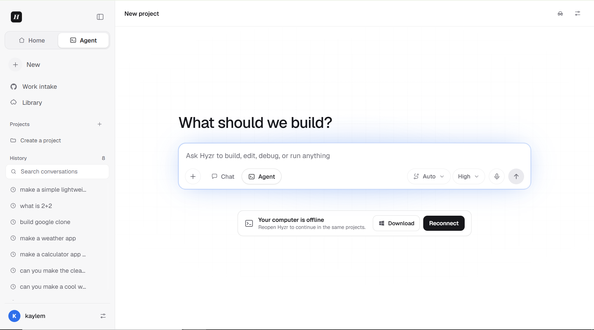
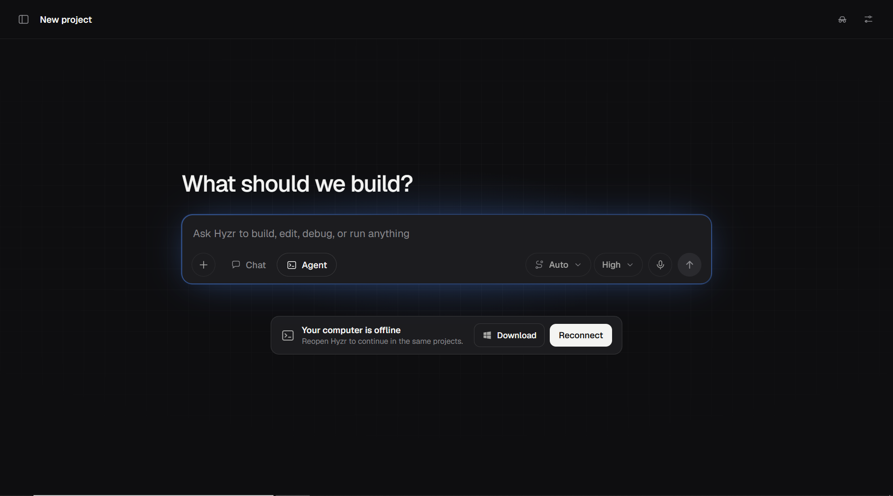
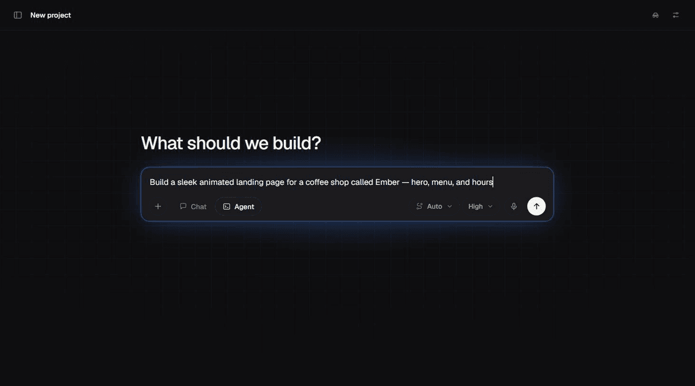

<div align="center">

# Hyzr Chat

**One chat box. Every frontier model. The right one on every subtask — automatically.**

[chat.hyzr.ai](https://chat.hyzr.ai)


<table>
  <tr>
    <td width="50%"></td>
    <td width="50%"></td>
  </tr>
  <tr>
    <td align="center"><sub>Light</sub></td>
    <td align="center"><sub>Dark</sub></td>
  </tr>
</table>

</div>

---

Hyzr Chat is where you talk to the best models on the planet — Claude, Codex, and more landing every month — without ever having to guess which one to use, or burn a premium subscription on work a cheaper model does just as well.

Here's the trick: you send one prompt, and Hyzr doesn't just hand it to a single model and hope. A routing model reads what you actually asked for, breaks it into subtasks, and quietly matches each subtask to the model that will do it best for the least usage. Planning goes to a planner. A tricky refactor goes to a heavyweight. Boilerplate, formatting, and exact deterministic work go to something fast — or to zero model calls at all. You get the quality of the most expensive model in the room on the parts that need it, and you stop paying for it everywhere else.

That's the whole point of the project: **spend as little of your subscription and tokens as humanly possible without ever dropping quality.** Not a cheaper model. The best result, assembled from the best pieces.

## How it works

<div align="center">



<sub>A real run, not a mockup: one prompt → the router explains its choice and picks Claude Opus 4.8 for the design work → the page builds and renders in a live preview.</sub>

</div>

Every prompt runs the same pipeline:

1. **Analyze** — the router classifies capability, complexity, modality, tool needs, and any provider constraints you've set.
2. **Split** — the request is decomposed into independent subtasks.
3. **Route** — each subtask is assigned the strongest *eligible* model, with lower subscription usage breaking ties among genuine equals. Exact, deterministic work runs natively and makes **zero** provider calls.
4. **Verify** — a separate checker (independent of the model that wrote the code) runs the narrowest tests, scans for leaked credentials, and drives static web builds in a real browser before anything is called done.

Quality is the gate. The savings are what fall out of never over-spending.

## Why it's different

- **Routing over roulette.** One prompt, many subtasks, the best model on each — instead of betting your whole request on a single model.
- **Zero-waste by design.** Deterministic operations cost nothing. Context packets are size-bounded. Runtime, retry, and token ceilings scale with the *actual* difficulty of the task, not a flat cap.
- **Verification you can trust.** Work that ran but failed its contract ends up flagged as `needs_attention` — it doesn't get quietly marked "done."

## Build from anywhere — PC, web, and phone, in real time

Sign in once and your entire workspace follows you. Chats, runs, projects, and live previews are server-owned, so whatever happens on one device shows up on the others instantly. Start a build on your laptop, watch it finish from your phone on the train, open a pull request from the couch. It's the same session everywhere, always in sync.

You can genuinely **develop apps, push to GitHub, view live deployments, and run commands straight from the web** — desktop or mobile.

## Pairing: your real machine, on the web

Download the tiny Hyzr launcher and pair it once. It adapts to your local environment and brings your existing setup online — your **Claude Code, Codex, Git, GitHub, and file system** — so the web app can drive them exactly as if you were sitting at your own terminal running Claude Code natively.

- The launcher is under 1 KB. It pulls a small relay runtime into `~/.hyzr`, connects outbound, and reconnects on its own next time.
- **Your machine runs the work. The cloud never touches your filesystem** — it hosts identity, synchronized state, and the UI, and asks your paired computer to do the CLI, Git, and preview work.
- No Electron app, no installer, no background service to babysit. Open it, keep it running, close it when you're done.

This is the fastest way I know to build complete apps entirely from the browser — with the power of your own dev environment behind it.

## Accounts

Your account is the thing that makes all of this portable. Signed in, you can spin up projects and ship them from any device, and any paired computer becomes available to that account on demand.

## Quick start

```bash
npm install
npm run dev
```

Run the full suite before you deploy:

```bash
npm run test:core
npm run test:browser
```

Deployment (Vercel + Upstash Redis, GitHub App, pairing) is documented in [DEPLOY.md](DEPLOY.md). Architecture and the routing/cost model are in [docs/ARCHITECTURE.md](docs/ARCHITECTURE.md).

---

Built by [hyzr](https://github.com/hyzr1). More models, more surfaces, coming soon.
